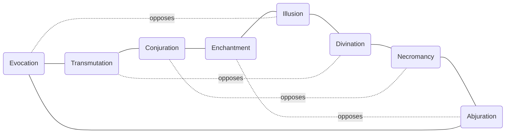

# Magic

## Schools of magic

All spellcasters have access to all eight schools from level 1. There is no gating by level or study in the base rules — the ceiling is set by Intelligence and mana pool, not by school access.

The eight schools are:

| School        | Domain                                           |
| ------------- | ------------------------------------------------ |
| Abjuration    | Protection, warding, counterspell                |
| Conjuration   | Summoning, teleportation, creation               |
| Divination    | Perception, foresight, information               |
| Enchantment   | Mind, compulsion, emotion                        |
| Evocation     | Raw force, elemental energy, damage              |
| Illusion      | Deception, sensory manipulation, misdirection    |
| Necromancy    | Death, undeath, life force                       |
| Transmutation | Physical alteration, transformation, enhancement |

!!! note "Placeholder"

    Spell lists per school to be developed separately.

---

## Spell levels

Spells range from cantrips to level 9. Access to higher spell levels is gated by **Intelligence**, not caster level. Caster level determines the size of the mana pool; Intelligence determines how high you can reach into it.

| Intelligence | Max spell level |
| ------------ | --------------- |
| 10–11        | 1               |
| 12–13        | 2               |
| 14–15        | 3               |
| 16–17        | 5               |
| 18–19        | 7               |
| 20–21        | 8               |
| 22+          | 9               |

Levels 4 and 6 are never a stable ceiling — they are only accessible in transit between Intelligence thresholds. A high-Intelligence low-level caster can reach powerful spells but has the mana pool to cast very few of them.

---

## Mana costs

Spell costs follow the **Fibonacci sequence**. This produces natural exponential growth without arbitrary inflation, and the values map cleanly onto the spell level range.

| Spell level | Mana cost |
| ----------- | --------- |
| Cantrip     | 1         |
| 1           | 1         |
| 2           | 2         |
| 3           | 3         |
| 4           | 5         |
| 5           | 8         |
| 6           | 13        |
| 7           | 21        |
| 8           | 34        |
| 9           | 55        |

At a mana pool of 140 (level 10, Intelligence 18), a level 9 spell consumes 39% of total mana. A caster gets roughly two before entering dangerous territory. Level 9 spells are events, not options.

---

## The Free Casting feat chain

Cantrips and level 1 spells both cost 1 mana — the Fibonacci sequence begins with two 1s. The **Free Casting** feat chain represents mastery so complete that the lower tiers of magic cost nothing.

Each tier of the chain is a separate feat requiring the previous tier as a prerequisite.

| Feat             | Effect                                                                             |
| ---------------- | ---------------------------------------------------------------------------------- |
| Free Casting I   | Cantrips cost 0 mana                                                               |
| Free Casting II  | Level 1 spells cost 0 mana · 1/day cast a level 1 spell at level 2 effect for free |
| Free Casting III | Level 2 spells cost 0 mana · 1/day cast a level 2 spell at level 3 effect for free |

The daily metamagic push at each tier boundary is not a cost reduction — it signals that the caster has so thoroughly internalised that level of magic that they can push it beyond its natural ceiling once per day without expenditure.

!!! note "Placeholder"

    The chain as written covers tiers I–III. Extension to higher tiers (IV+) to be determined during playtesting — the pattern holds but balance at high levels needs verification.

---

## The school sacrifice ring (Specialist subclass)

The Specialist subclass organises the eight schools into a **ring**, with each school having a direct opposite across the ring. Sacrificing access to schools on either side of your chosen school unlocks deeper feature tiers within it.

### Ring arrangement



ring:

```
Evocation — Transmutation — Conjuration — Enchantment
    |                                           |
Abjuration — Necromancy  — Divination  — Illusion
```

### Sacrifice mechanics

Sacrifices peel **symmetrically outward** from the chosen school in both directions simultaneously. You cannot sacrifice one neighbour without the other.

Taking an Evocation specialist as an example:

| Sacrifice tier | Schools lost               | Feature unlocked         |
| -------------- | -------------------------- | ------------------------ |
| 0 (none)       | —                          | Tier 1 (base specialist) |
| 1              | Transmutation + Abjuration | Tier 2                   |
| 2              | Conjuration + Enchantment  | Tier 3                   |
| 3              | Divination + Illusion      | Tier 4                   |
| 4              | Illusion (opposite)        | Tier 5 (savant)          |

Sacrificed schools are removed from the spell list entirely. The mana that would have gone to them does not transfer — the well simply has fewer channels.

Sacrifices are made **at subclass selection (level 4)** and can be deepened on subsequent levels. They are never reversed.

### Specialist and mana costs

Spells from the chosen school cost **−20% mana per sacrifice tier**, rounded down, minimum 1. A tier 4 specialist casts their school's spells at 20% of base cost.

| Sacrifice tier | Cost multiplier |
| -------------- | --------------- |
| 0              | 100%            |
| 1              | 80%             |
| 2              | 60%             |
| 3              | 40%             |
| 4              | 20%             |

!!! note "Placeholder"

    Feature tier contents (what each tier unlocks per school, across all 8 schools) to be developed separately. Five tiers × eight schools = 40 feature blocks.

---

## Spellcaster subclasses summary

| Subclass           | Focus                                                       |
| ------------------ | ----------------------------------------------------------- |
| Generalist         | Access to all schools; no sacrifice ring; shallower ceiling |
| Specialist         | Deep in one school via sacrifice ring                       |
| Battle Mage        | Spellcasting + martial hybrid                               |
| Artificer-adjacent | Imbuing and crafting focus                                  |

!!! note "Placeholder"

    Full subclass writeups to be developed. Generalist ceiling relative to Specialist to be balanced during playtesting. Battle Mage interaction with sacrifice ring to be determined.
